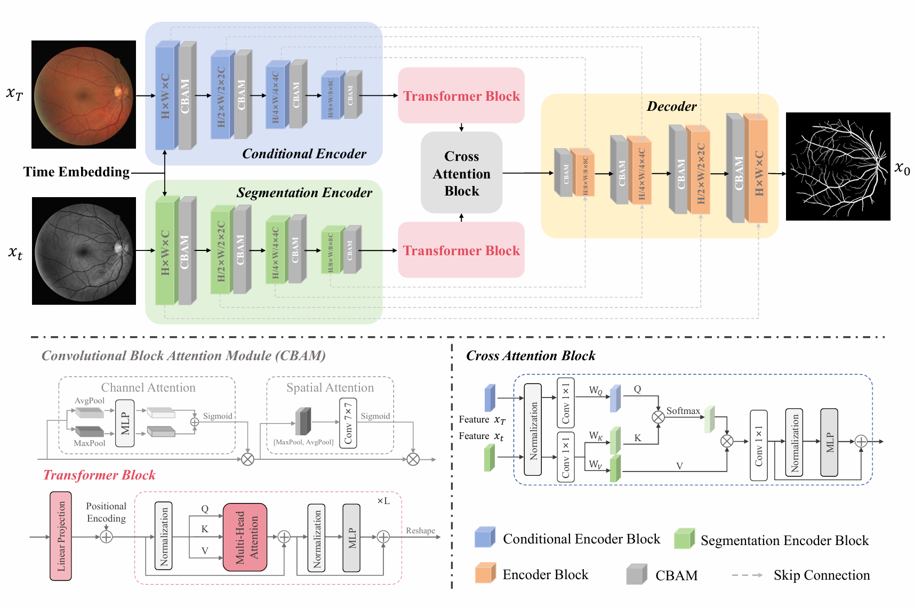

# CC-DiT

CC-DiT is a conditional cold diffusion framework for retinal vessel segmentation.  
This repository provides the training and inference code for structure-preserving retinal vessel segmentation with conditional restoration, attention-based feature refinement, and topology-aware supervision.

---

## Overview

Retinal vessel segmentation is challenging because of thin vessels, low contrast, vessel crossings, and lesion-like interference.  
CC-DiT formulates segmentation as a conditional cold diffusion restoration process, where a vessel mask is reconstructed progressively under the guidance of the corresponding fundus image.

The current implementation includes:

- conditional cold diffusion segmentation
- CBAM-based feature refinement
- ViT-based global context modeling
- hybrid loss with Dice, clDice, and BCE
- sliding-window inference for high-resolution retinal images

---

## Framework

<p align="center">
  
</p>

CC-DiT combines conditional cold diffusion restoration, hierarchical attention calibration, and global feature modeling for retinal vessel segmentation.


## Requirements

This project was developed with Python 3.8 and PyTorch 1.11.

Install dependencies with:

```bash
pip install -r requirements.txt
```

A minimal `requirements.txt` is:

```txt
torch==1.11.0
torchvision==0.12.0
numpy==1.22.4
opencv-python==4.11.0.86
matplotlib==3.5.2
tqdm==4.61.2
accelerate==1.0.1
einops==0.8.0
beartype==0.19.0
scikit-learn==0.24.2
scikit-image==0.21.0
scipy==1.5.4
Pillow==9.1.1
PyYAML==6.0.2
wandb==0.19.1
```

---

## Dataset Preparation

The code is designed for retinal vessel segmentation datasets such as:

- DRIVE
- STARE
- CHASE_DB1

Please organize your datasets in a local directory and modify the dataset root path in the scripts.

A typical structure is:

```text
retinal_vascular/
├── DRIVE/
│   ├── images/
│   └── labels/
├── STARE/
│   ├── images/
│   └── labels/
└── CHASE_DB1/
    ├── images/
    └── labels/
```

You need to manually edit the paths in the scripts before running:

- in `train.py`
  - `root`
  - `save_dir`

- in `sample.py`
  - `root`
  - `load_model_from`
  - `inference_dir`

---

## Training

Run training with:

```bash
python train.py
```

The current training pipeline includes:

- grayscale fundus input
- image size `512 × 512`
- batch size `1`
- diffusion time steps `50`
- AdamW optimizer
- mixed precision training with `accelerate`
- gradient accumulation
- sliding-window validation
- checkpoint saving during later epochs
- training loss curve saving

---

## Inference

Run inference with:

```bash
python sample.py
```

The inference pipeline supports:

- sliding-window prediction for large retinal images
- Gaussian-weighted tile merging
- binary mask generation
- overlay visualization
- quantitative metric calculation

The current implementation saves:

- original image
- predicted binary mask
- ground-truth mask
- overlay visualization
- per-image evaluation metrics
- average metrics summary

---

## Pretrained Weights

We provide pretrained weights for retinal vessel segmentation datasets [here](https://pan.baidu.com/s/133XHpM9FAfRc0fl9qgXvYA?pwd=q5sq).  
Extraction code: `q5sq`  

